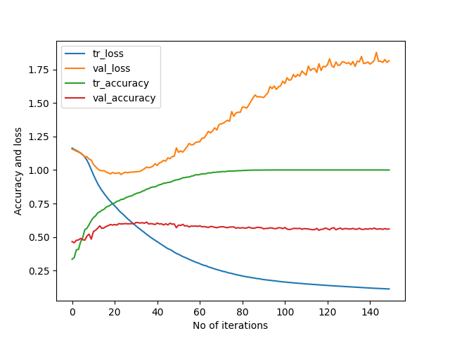

# DrivingDirection-8-61-1
163/163 [==============================] - 1s 3ms/step - loss: 0.1128 - accuracy: 1.0000 - val_loss: 1.8145 - val_accuracy: 0.5602  
[[226  56  55]    
 [ 77  75  22]    
 [ 92  16 104]]   
163/163 [==============================] - 0s 872us/step - loss: 0.5116 - accuracy: 0.8609    
23/23 [==============================] - 0s 1ms/step - loss: 1.0219 - accuracy: 0.6113        
Train: 0.861, Test: 0.611    
[[243  57  37]               
 [ 73  87  14]                  
 [ 81  19 112]]                

 
